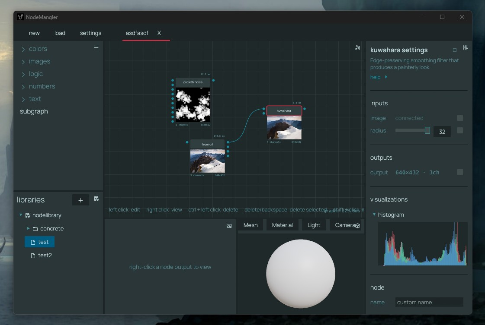

# NodeMangler

An node-based image editor and procedural texture generator. Similar to Substance Designer and Material Maker but open source, free and not built on top of a game engine.  100% Rust and very fast.  GUI to create graphs and CLI to integrate them into your workflow.



I wrote the framework for this back in 2023, intending it to be a replacement for
Substance Designer, but lost interest. Picked it up again in 2026 with the help of
Claude.

## Features

- **383 nodes** across images, colors, numbers, logic, and text — see the full
  [Node Reference](#node-reference) below.
- **Procedural generation** — 45 noise generators.
- **14 color spaces** with conversion between them: sRGB, Linear RGB, HSL, HSV, HWB,
  Lab, LCH, Oklab, Oklch, CMYK, XYZ, xyY, YUV, YCbCr.
- **Floating-point pipeline** — images stay 1–4 channel `f32` from input to output;
  conversion only happens at I/O.
- **16 file formats** — PNG, JPEG, GIF, WebP, TIFF, TGA, BMP, ICO, PNM, QOI, Farbfeld,
  Radiance HDR, OpenEXR, JPEG XL, PSD, and AVIF (JPEG XL and PSD are read-only, AVIF
  write-only) and 8/16/32-bit-float output color formats.
- **Subgraphs** — package an entire pipeline into a single reusable node.
- **GUI and CLI** — build graphs visually in the desktop app or headless from the
  command line. Both share the same JSON graph format, and the CLI is designed to be
  easy for scripts and LLMs to drive.

## Build & run

```bash
cd app
cargo run -p mangler_gui    # launch the desktop app
cargo run -p mangler_cli    # run graphs headless (see the CLI README)
cargo build                 # build everything
cargo test                  # run the test suite
```

## How it works

Nodes are instances of *operations* — each declares its inputs, outputs, and async
processing logic. Values (numbers, colors, images, text, …) flow along connections and
auto-convert where it makes sense. The engine runs on a tokio runtime: when an input
changes, affected nodes are marked dirty and re-execute in dependency order, with
results propagating downstream. Graphs save as JSON and round-trip freely between the
GUI and the CLI.

See the [mangler_core README](app/crates/mangler_core/README.md) for the engine
internals.

## Repository structure

- `app/` — Rust application (Cargo workspace)
- `website/` — Website (future)

| Crate | Path | Purpose |
|-------|------|---------|
| [**mangler_core**](app/crates/mangler_core/README.md) | `app/crates/mangler_core/` | The engine — value system, node graph, operation library, color spaces |
| [**mangler_gui**](app/crates/mangler_gui/README.md) | `app/crates/mangler_gui/` | Desktop app built with egui/eframe |
| [**mangler_cli**](app/crates/mangler_cli/README.md) | `app/crates/mangler_cli/` | Headless CLI for building and running graphs |

Each crate README goes into detail on that component.

## Node Reference

Every node in the graph editor's Add Node menu, by category and subcategory
(339 operation nodes, plus subgraph nodes for composing whole pipelines).

### Numbers (104)

- **Input:** Decimal, E, Integer, Phi, Pi, Tau
- **Algebraic:** Absolute Value, Cube Root, Distance 2D, Factorial, GCD, Hypot, LCM, Nth Root, Power, Square Root
- **Arithmetic:** Add, Average, Ceil, Clamp, Decrement, Divide, Floor, Fractional Part, Increment, Max, Min, Modulus, Multiply, Negate, Ping Pong, Reciprocal, Round, Sign, Snap, Subtract, Truncate, Wrap
- **Bitwise:** Bitwise And, Bitwise Not, Bitwise Or, Bitwise Xor, Shift Left, Shift Right
- **Cast:** To Decimal, To Integer
- **Curve:** Area, Bounds, Centroid, Length, Point Count, Sample Point
- **Image:** Average Hue, Bounding Box, Centroid, Coverage, Dimensions, Edge Density, Entropy, Image Difference, Kurtosis, Mean, Median, Min Max, Percentile, Perceptual Hash, Sharpness, Skewness, Standard Deviation, Unique Colors
- **Interpolation:** Lerp, Map Range, Smoothstep, Step
- **Logarithmic:** Exp, Ln, Log, Log10, Log2
- **Random:** Random Decimal, Random Gaussian, Random Integer
- **Text:** Byte Length, Count Occurrences, Index Of, Line Count, Parse Decimal, Parse Integer, Word Count
- **Trigonometry:** Acos, Acosh, Asin, Asinh, Atan, Atan2, Atanh, Cos, Cosh, Sin, Sinh, Tan, Tanh, To Degrees, To Radians

### Colors (53)

- **Input:** CMYK, HSL, HSV, HWB, Lab, LCH, Oklab, Oklch, RGB, RGB Linear, xyY, XYZ, YCbCr, YUV
- **Output:** To CMYK, To HSL, To HSV, To HWB, To Lab, To LCH, To Oklab, To Oklch, To RGB, To RGB Linear, To xyY, To XYZ, To YCbCr, To YUV
- **Analysis:** Color Temperature, Contrast Ratio, Distance, Dominant Hue, Harmony Score, Luminance, Mix Ratio, Most Common Colors, Sample Pixel
- **Generation:** From Hex, Random Color, To Color, To Hex
- **Harmony:** Analogous, Complementary, Double Split Comp, Monochromatic, Tetradic, Triadic
- **Manipulation:** Adjust HSV, Blend, Clamp, Grayscale, Invert, Set Alpha

### Curves (24)

- **Input:** Curve
- **Combine:** Join, Morph
- **Generators:** Arc, Ellipse, Fractal Line, Lissajous, Polygon, Random Walk, Spiral, Star, Superellipse, Wave
- **Modify:** Jitter, Mirror, Offset, Resample, Reverse, Round Corners, Simplify, Smooth, Transform, Trim
- **Simulation:** Meander

### Images (180)

- **Input:** Constant, From Clipboard, From Color, From File, From Gradient, From Text, From URL
- **Output:** Material, To Clipboard, To File
- **Adjustments:** Auto Levels, Brighten, Color Balance, Color Match, Color To Mask, Contrast, Curves, Dither, Frequency Split, Gradient Dynamic, Gradient Map, Grayscale, Histogram Range, Histogram Scan, Histogram Select, HSL, Hue Shift, Invert, Levels, Posterize, Replace Color, Saturation, Selective Color, Threshold, Vignette, White Balance
- **Blur:** Blur, Directional Blur, Non-Uniform Blur, Radial Blur, Slope Blur
- **Cast:** To Image
- **Channels:** Channel Merge, Channel Mixer, Channel Select, Channel Shuffle, Channel Split
- **Combine:** Blend, Compare, Composite
- **Filter / Edges:** Canny, Difference Of Gaussians, Edge Detect, Highpass, Luminance Highpass, Sharpen, Unsharp Mask
- **Filter / Smoothing:** Anisotropic Diffusion, Bilateral, Guided Filter, Median, Non Local Means, SNN
- **Filter / Morphology:** Black Hat, Close, Dilate, Distance Field, Erode, Morphological Gradient, Open, Outline, Top Hat, Vector Morphology
- **Filter / Stylize:** Anisotropic Kuwahara, ASCII, Cross Hatch, Emboss, Halftone, Kuwahara, Oil Paint, Pixelate, Toon
- **Filter / Dither:** Floyd Steinberg, Ordered Dither
- **Filter:** Convolution
- **FX:** Drop Shadow, Inner Glow, Outer Glow
- **Noise:** Anisotropic Noise, Billow Noise, Blue Noise, Caustics Noise, Checkerboard Noise, Cloud Noise, Concentric Rings, Craters, Crystal Noise, Curl Noise, Dirt Noise, Domain Warp, Erosion, Fault Terrain, FBM Noise, Fibers, Flow Noise, Gabor Noise, Growth Noise, Hybrid Multifractal Noise, Leaks Noise, Lightning Noise, Multifractal Noise, Open Simplex Noise, Peeling Noise, Perlin Noise, Phasor Noise, Plasma Noise, Reaction Diffusion, Ridged Multifractal Noise, Rolling Hills, Scales, Scratches, Smear Noise, Spectral Terrain, Stains Noise, Super Simplex Noise, Truchet Tiles, Value Noise, Veins Noise, Voronoi Blend, Voronoi Crack Noise, Warped Rings Noise, Wave, White Noise, Worley Distance Noise, Worley Value Noise
- **Patterns:** Brick, Flood Fill, Flood Fill Mapper, Hexagonal, Splatter, Tile Generator, Tile Sampler, Weave
- **PBR:** AO From Height, Bevel, Curvature, Height Blend, Normal Blend, Normal Combine, Normal From Height, Normal Invert, Normal To Height
- **Shapes:** Circle, Cone, Ellipse, Line, Paraboloid, Polygon, Pyramid, Rasterize Curve, Rectangle, Star
- **Simulation:** Carve River, Guided Rolling Hills, Hillslope Diffusion, Hydraulic Erosion
- **Transform:** Crop, Directional Warp, Flip Horizontal, Flip Vertical, Kaleidoscope, Make Tile, Mirror, Perspective, Polar Coordinates, Resize, Resize Exact, Resize Fill, Rotate, Rotate 180, Rotate 270, Rotate 90, Seam Carve, Spherize, Swirl, Transform, Warp

### Logic (22)

- **Input:** Boolean
- **Boolean:** And, Nand, Nor, Not, Or, Xnor, Xor
- **Comparison:** Approx Equal, Equal, Greater Or Equal, Greater Than, In Range, Less Or Equal, Less Than, Not Equal
- **Flow:** Select
- **Text:** Contains, Ends With, Equals Ignore Case, Is Empty, Starts With

### Text (26)

- **Input:** Text
- **Encoding:** Base64 Decode, Base64 Encode, Url Decode, Url Encode
- **Image:** Ascii Art, Data Uri, Image Hash, Image Info, Palette Hex
- **Manipulation:** Append, Format Number, Join, Length, Pad, Repeat, Replace, Reverse, Split, Substring, Template, Title Case, To Lowercase, To String, To Uppercase, Trim

## License

MIT OR Apache-2.0, at your option — see [LICENSE.md](LICENSE.md).
